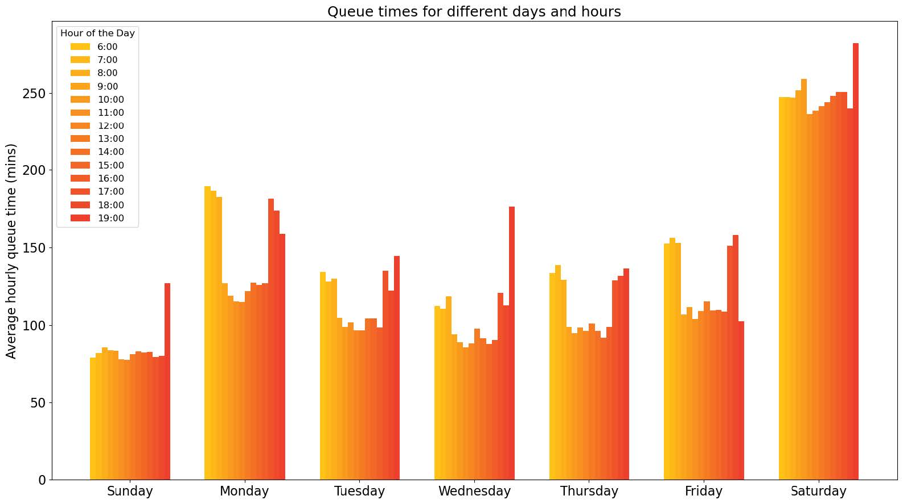

# Part 2 – Service Performance Analysis

## 🗂 Analysis Workflow
The notebook for Part 2 is divided into **7 sections**, each focusing on different aspects of water service performance:

1. **Cleaning Our Data**  
   - Prepared the employee table for communication and analysis.  
   - Generated email addresses using `CONCAT`, `REPLACE`, and `LOWER`.  
   - Trimmed spaces from phone numbers and ensured consistent length.

2. **Honouring the Workers**  
   - Recognized top-performing field surveyors.  
   - Counted employees per town and identified the top 3 surveyors by visit count.  
   - Retrieved their names, emails, and phone numbers for recognition.

3. **Analysing Locations**  
   - Explored the geographic distribution of water sources.  
   - Counted records per town and province, highlighting hotspots.  
   - Calculated the percentage of rural vs urban sources (~60% rural).

4. **Diving into the Sources**  
   - Assessed water source types and usage.  
   - Counted total people surveyed, and averaged users per source type.  
   - Calculated total population served and ranked sources using `RANK`, `DENSE_RANK`, and `ROW_NUMBER`.

5. **Start of a Solution**  
   - Prioritized repairs based on impact.  
   - Ranked individual sources within each type by population served.  
   - Filtered for improvable sources (shared taps, wells, rivers) to guide repair teams.

6. **Analysing Queues**  
   - Investigated wait times at water sources.  
   - Calculated survey duration with `DATEDIFF` and average queue times using `NULLIF` to exclude zeroes.  
   - Grouped queue times by day and hour, building pivot-style tables for patterns.

7. **Reporting Insights**  
   - Summarized findings for decision-makers.  
   - Key insights:  
     - 43% use shared taps; ~2,000 people share one on average.  
     - 31% have home taps, but 45% are non-functional.  
     - 18% use wells, with only 28% being clean.  
     - Queue times average 123 minutes, especially long on Saturdays and mornings.  
     - Rural areas dominate the dataset and need focused infrastructure support.

### Queue Times for Different Days and Hours

This graph illustrates how queue durations vary across different days and hours. It highlights peak congestion periods, especially Saturdays and early mornings, and helps guide short-term tanker deployment and long-term tap installation strategies.

---

*This part demonstrates data cleaning, employee and location analysis, queue pattern evaluation, and prioritization of water source interventions.*
