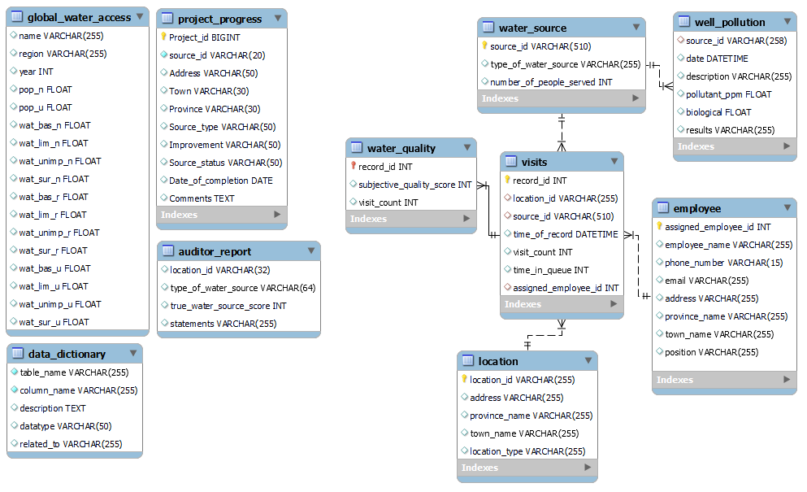

# Part 3 – Quality & Pollution Assessment  

🗂 **Analysis Workflow**  
The notebook for Part 3 is divided into 4 main sections, each deepening the investigation into water quality, contamination patterns, and survey accuracy:  

### 1. Generating an ERD  
- Developed an **Entity Relationship Diagram (ERD)** to visualize the structure of the database.  
- This provided a roadmap for how water quality, visits, and auditor data connect.  

📌 *ERD Reference:*  
  
 

---

### 2. Integrating the Report  
- Added the **auditor report** into the database by creating a dedicated table and importing external CSV data.  
- Compared auditor scores against employee-reported scores for water quality.  
- Identified inconsistencies in quality assessments between field staff and auditors.  

---

### 3. Linking Records  
- Connected auditor, employee, and water quality data.  
- Identified employees responsible for mismatches between reported and true quality scores.  
- Built common table expressions (CTEs) to calculate error counts per employee.  

---

### 4. Gathering Evidence  
- Investigated surveyors with error counts **above the average**, highlighting potential negligence or corruption.  
- Created views and suspect lists to systematically track misreporting.  
- Filtered records tied to “suspect” employees, strengthening accountability and evidence-building.  

---

🧠 **Key Insights**  
- Field survey data was not always reliable — auditors uncovered discrepancies in reported water quality.  
- Some employees repeatedly made mistakes above the acceptable average, pointing to training gaps or malpractice.  
- Creating CTEs and views enabled systematic auditing, ensuring water quality assessments are based on accurate, verifiable data.  
- These findings are critical to protecting public health and targeting interventions where contamination risks are highest.  

---

📓 **Notebook**  
You can explore the full SQL workflow here: [Part 3 – Quality & Pollution Assessment Notebook](./Part3_Quality_Pollution_Assessment.ipynb)  
